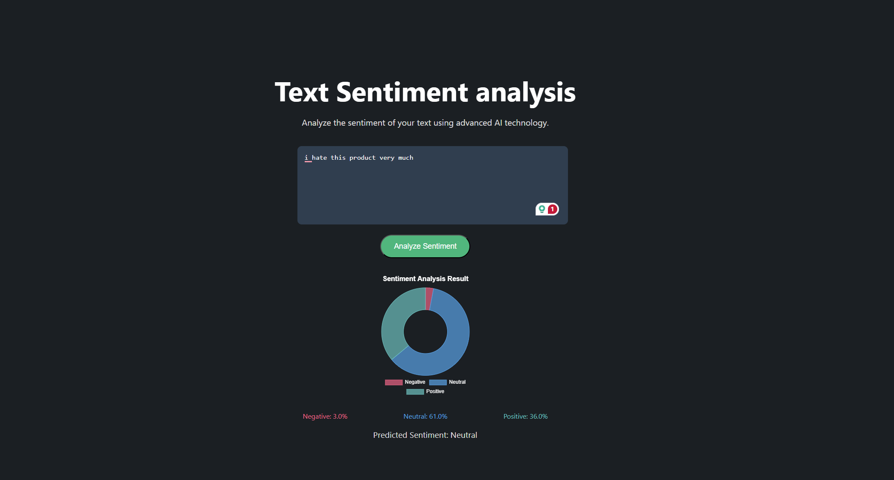

# Sentiment Analysis (NLP) — Amazon Reviews

A course project that explores **multiple approaches to text sentiment analysis** (Negative / Neutral / Positive) on the _Amazon Product Reviews_ dataset. The goal is to compare how different modeling choices behave—from classic TF‑IDF + linear models, to an LSTM, to a more robust **V3 ensemble** with sentiment-aware preprocessing and combined **word + character n‑gram** features. A small **Flask web app** is included to demo the V3 model with probability visualizations.

## Report

- [Full project report (PDF)](./report.pdf)

## Web app example



## What’s inside (high level)

- **Initial approach (V1):** TF‑IDF features + Naive Bayes / Logistic Regression baselines.
- **V2:** improved preprocessing + augmentation experiments + an LSTM attempt.
- **V3 (used by the web app):** sentiment-aware text cleaning + dual TF‑IDF (word + char) + a weighted ensemble (soft voting + SVM).

## Run the web version (Flask)

### Prerequisites

- Python 3.10+ recommended

### Setup & run

From the repository root:

```powershell
python -m venv .venv
.\.venv\Scripts\activate
pip install -r requirements.txt
python web\app.py
```

Then open:

- http://127.0.0.1:5000

### Notes / troubleshooting

- The web app loads these artifacts on startup:
  - `processed_data\v3_ensemble_model.pkl`
  - `processed_data\v3_vectorizers.pkl`
- If you see an import error for SciPy, install it:
  ```powershell
  pip install scipy
  ```

## API (used by the web page)

- `POST /analyze`
  - Body: `{"text": "your text here"}`
  - Response: predicted sentiment + class probabilities
