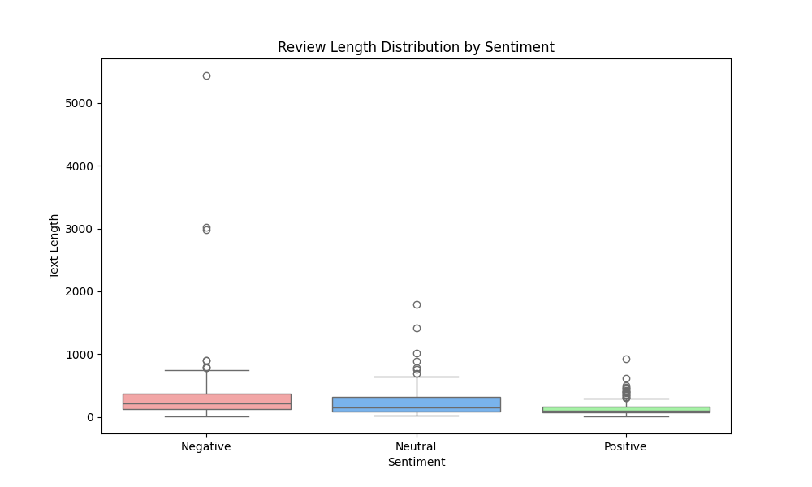

# Amazon Reviews Sentiment Analysis - Approach Comparison

## Initial Approach

### Data Processing
- Dataset: Amazon Product Reviews Dataset
- We pull out rating from the dataset and convert it to a sentiment class with 0-2 will be negative, 3 will be neutral, and 4-5 will be positive.
- Balanced sampling with 142 reviews per class (426 total reviews), becasue of the amount of data on the 5 star reviews being to hight up to 5000. Compare with the 3 star reviews being under 500.
- Text preprocessing pipeline:
  - Lowercase conversion
  - URL removal
  - Special character removal
  - Stopword removal
  - Lemmatization
  - Short word removal (length < 2)
- Train/Test split of 80/20

### Feature Engineering
- TF-IDF Vectorization using scikit-learn
- Parameters:
  - max_features=100000
  - min_df=5
  - max_df=0.95
  - ngram_range=(1, 2)

### Models
1. Naive Bayes Classifier (MultinomialNB)
   - result: 0.65 accuracy

2. Logistic Regression
   - result: 0.66 accuracy

### Conclusion to the initial approach
Both models have the score of f1-score below 50% on neutral. but the score of positive and negative are above 60%.
Both models are very bad at predicting the sentiment of the review. With the model not predicting any Negative when inserting new data.
It might be because of the model or the data of each class have too much apart in term of text length.
Showing here:



---

## New Approach
Change up how we process the data and use a new model to see if it will perform better.

### Data Processing Improvements
- Changed how we handle text length:
  - Set max length to 200 words
  - For long reviews: Keep first 75% and last 25% to get both the main point and conclusion
  - For short reviews: Keep them as they are
- Better text cleaning:
  - Convert emojis to words with spaces
  - Keep important markers like !!!, ???, ..., :), :(
  - Keep words like 'no', 'not', 'never' that change the meaning
  - Only clean up words that don't show feeling/emotion
- Keep same number of reviews per class (142 each)
- Made three ways to create more training data (based on Gong et al., 2022[^1]):
  1. Replace words with similar meaning words using WordNet dictionary
  2. Mix up the order of sentences but keep the last one (usually has the main opinion)
  3. Mix two reviews together using mixup (combine both the text and their ratings)
  - Each review gets two new versions:
    - One with replaced words
    - One with mixed up sentences (if the review is long enough)
  - Also add mixed pairs of reviews to help the model learn better

### Test with the same models
1. Naive Bayes Classifier (MultinomialNB) with improved processing:
   - Accuracy deproved from 0.65 to 0.62

2. Logistic Regression with improved processing:
   - Accuracy deproved from 0.66 to 0.65

### Test with a new model (LSTM)
- Implemented LSTM neural network with pre-trained embeddings:
  - GloVe embeddings (200 dimensions)
  - Embedding layer with frozen pre-trained weights
  - Bidirectional LSTM layer with 64 units (return sequences)
  - Dropout layer (0.3)
  - Bidirectional LSTM layer with 32 units
  - Dropout layer (0.3)
  - Dense layers (64 -> 32 -> 3) with ReLU and softmax activations
  - Added BatchNormalization layers for better training stability
- Training parameters:
  - Batch size: 8 (small batch for better generalization)
  - Epochs: 20 with early stopping
  - Early stopping patience: 5 epochs
  - Validation split: 0.2
- Data handling:
  - Enhanced sentiment-aware data augmentation:
    * Careful preservation of negative words and phrases
    * Improved synonym replacement logic
    * Sentiment-aware sentence reordering
  - Stratified train-test split
  - Text sequence padding to 200 tokens with masking
- Results:
  - Test accuracy: 98%
  But the prediction on unseen data is incredibly bad. It detect all the review as positive.
```
Review: 'This product is terrible'
Predicted sentiment: Positive
Confidence scores:
  Negative: 2.19%
  Neutral:  17.61%
  Positive: 80.20%

Review: 'It's okay, nothing special'
Predicted sentiment: Positive
Confidence scores:
  Negative: 1.51%
  Neutral:  7.65%
  Positive: 90.84%

Review: 'Amazing product, I love it!'
Predicted sentiment: Positive
Confidence scores:
  Negative: 0.01%
  Positive: 90.84%
```

### Conclusion to the new approach
The enhanced preprocessing and LSTM model implementation revealed several important findings:

1. Model Performance Issues:
   - Initial LSTM without augmentation achieved ~54% accuracy
   - Adding augmentation improved accuracy to 98% but led to severe overfitting
   - Both versions (with and without augmentation) performed poorly on unseen data
   - Model consistently predicts "Positive" with high confidence, even for negative reviews
   - Traditional models (Naive Bayes, Logistic Regression) showed more reliable results

2. Data Processing Impact:
   - Enhanced preprocessing actually decreased performance in traditional models
   - Complex text augmentation might have introduced noise
   - Keeping sentiment markers and negation words didn't improve results as expected
   - Text length normalization didn't help with prediction accuracy

3. LSTM Model Limitations:
   - Small dataset (426 original reviews) insufficient for deep learning
   - Data augmentation, while improving training accuracy, didn't help with generalization
   - Pre-trained embeddings couldn't compensate for limited training data
   - Model struggles with sentiment comprehension despite high training accuracy

4. Key Learnings:
   - More complex models don't always mean better results
   - Data quality and quantity are crucial for deep learning approaches
   - Traditional models handle small datasets better
   - Augmentation can improve training metrics but may hurt real-world performance

5. Recommendations for Future Work:
   - Collect larger, high-quality dataset (at least 1000 reviews per class)
   - Simplify augmentation techniques to preserve original sentiment
   - Consider ensemble methods combining traditional and deep learning approaches
   - Implement attention mechanisms to better capture sentiment-critical phrases
   - Add sentiment-specific word embeddings alongside GloVe

The results suggest that for this specific task and dataset size, simpler traditional models are more reliable. The LSTM approach, while theoretically more powerful, requires significantly more data and careful tuning to outperform traditional methods in sentiment analysis, regardless of whether augmentation is used.

---
### References

[^1]: Gong, X., Ying, W., Zhong, S., & Gong, S. (2022). Text Sentiment Analysis Based on Transformer and Augmentation. Frontiers in Psychology, 13, 906061. https://www.frontiersin.org/journals/psychology/articles/10.3389/fpsyg.2022.906061/full
