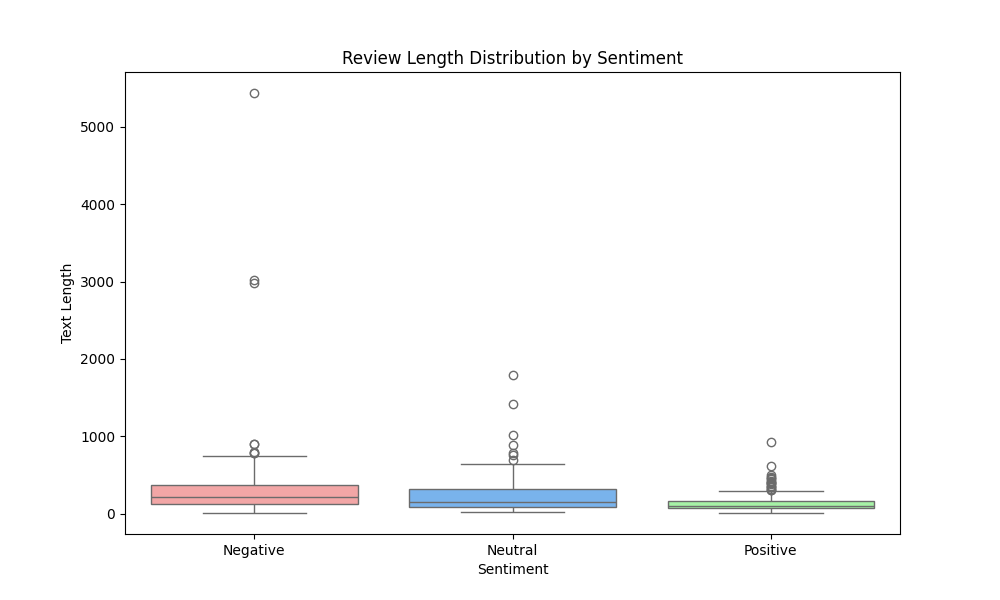

# Amazon Reviews Sentiment Analysis - Approach Comparison

## Initial Approach

### Data Processing
- Dataset: Amazon Product Reviews Dataset
- We extract reviews from the amazon_reviews.csv file, focusing on the 'reviewText' and 'overall' columns
- Ratings are converted to sentiment classes: 0-2 as negative (0), 3 as neutral (1), and 4-5 as positive (2)
- Balanced sampling with equal number of reviews per sentiment class to prevent bias
- Robust data handling with encoding detection and error handling for CSV parsing
- Text preprocessing pipeline:
  - Lowercase conversion
  - URL removal
  - Special character removal
  - Stopword removal
  - Lemmatization
  - Short word removal (length < 2)
- Train/Test split of 80/20

### Feature Engineering
- TF-IDF Vectorization using scikit-learn
- Parameters:
  - max_features=100000
  - min_df=5
  - max_df=0.95
  - ngram_range=(1, 2)

### Models
1. Naive Bayes Classifier (MultinomialNB)
   - result: 0.65 accuracy

2. Logistic Regression
   - result: 0.66 accuracy

### Conclusion to the initial approach
Both models have the score of f1-score below 50% on neutral. but the score of positive and negative are above 60%.
Both models are very bad at predicting the sentiment of the review. With the model not predicting any Negative when inserting new data.
It might be because of the model or the data of each class have too much apart in term of text length.
Showing here:



---

## New Approach (V2)
Change up how we process the data and use a new model to see if it will perform better.

### Data Processing Improvements
- Changed how we handle text length:
  - Set max length to 200 words
  - For long reviews: Keep first 75% and last 25% to get both the main point and conclusion
  - For short reviews: Keep them as they are
- Better text cleaning:
  - Convert emojis to words with spaces
  - Keep important markers like !!!, ???, ..., :), :(
  - Keep words like 'no', 'not', 'never' that change the meaning
  - Only clean up words that don't show feeling/emotion
- Keep same number of reviews per class (142 each)
- Made three ways to create more training data (based on Gong et al., 2022[^1]):
  1. Replace words with similar meaning words using WordNet dictionary
  2. Mix up the order of sentences but keep the last one (usually has the main opinion)
  3. Mix two reviews together using mixup (combine both the text and their ratings)
  - Each review gets two new versions:
    - One with replaced words
    - One with mixed up sentences (if the review is long enough)
  - Also add mixed pairs of reviews to help the model learn better

### Test with the same models
1. Naive Bayes Classifier (MultinomialNB) with improved processing:
   - Accuracy deproved from 0.65 to 0.62

2. Logistic Regression with improved processing:
   - Accuracy deproved from 0.66 to 0.65

### Test with a new model (LSTM)
- Implemented LSTM neural network with pre-trained embeddings:
  - GloVe embeddings (200 dimensions)
  - Embedding layer with frozen pre-trained weights
  - Bidirectional LSTM layer with 64 units (return sequences)
  - Dropout layer (0.3)
  - Bidirectional LSTM layer with 32 units
  - Dropout layer (0.3)
  - Dense layers (64 -> 32 -> 3) with ReLU and softmax activations
  - Added BatchNormalization layers for better training stability
- Training parameters:
  - Batch size: 8 (small batch for better generalization)
  - Epochs: 20 with early stopping
  - Early stopping patience: 5 epochs
  - Validation split: 0.2
- Data handling:
  - Enhanced sentiment-aware data augmentation:
    * Careful preservation of negative words and phrases
    * Improved synonym replacement logic
    * Sentiment-aware sentence reordering
  - Stratified train-test split
  - Text sequence padding to 200 tokens with masking
- Results:
  - Test accuracy: 98%
  But the prediction on unseen data is incredibly bad. It detect all the review as positive.
```
Review: 'This product is terrible'
Predicted sentiment: Positive
Confidence scores:
  Negative: 2.19%
  Neutral:  17.61%
  Positive: 80.20%

Review: 'It's okay, nothing special'
Predicted sentiment: Positive
Confidence scores:
  Negative: 1.51%
  Neutral:  7.65%
  Positive: 90.84%

Review: 'Amazing product, I love it!'
Predicted sentiment: Positive
Confidence scores:
  Negative: 0.01%
  Positive: 90.84%
```

### Conclusion to the new approach
The enhanced preprocessing and LSTM model implementation revealed several important findings:

1. Model Performance Issues:
   - Initial LSTM without augmentation achieved ~54% accuracy
   - Adding augmentation improved accuracy to 98% but led to severe overfitting
   - Both versions (with and without augmentation) performed poorly on unseen data
   - Model consistently predicts "Positive" with high confidence, even for negative reviews
   - Traditional models (Naive Bayes, Logistic Regression) showed more reliable results

2. Data Processing Impact:
   - Enhanced preprocessing actually decreased performance in traditional models
   - Complex text augmentation might have introduced noise
   - Keeping sentiment markers and negation words didn't improve results as expected
   - Text length normalization didn't help with prediction accuracy

3. LSTM Model Limitations:
   - Small dataset (426 original reviews) insufficient for deep learning
   - Data augmentation, while improving training accuracy, didn't help with generalization
   - Pre-trained embeddings couldn't compensate for limited training data
   - Model struggles with sentiment comprehension despite high training accuracy

4. Key Learnings:
   - More complex models don't always mean better results
   - Data quality and quantity are crucial for deep learning approaches
   - Traditional models handle small datasets better
   - Augmentation can improve training metrics but may hurt real-world performance

The results suggest that for this specific task and dataset size, simpler traditional models are more reliable. The LSTM approach, while theoretically more powerful, requires significantly more data and careful tuning to outperform traditional methods in sentiment analysis, regardless of whether augmentation is used.

---
## V3 Approach (Ensemble Method)
After learning from our previous approaches, we developed an ensemble method that focuses on three key areas:

### 1. Advanced Data Processing
- **Improved Text Cleaning:**
  - We preserved sentiment-critical punctuation (!!!, ???, ..., !?, ?!) by adding spaces around them, helping these markers remain during tokenization
  - We expanded contractions using the `contractions` library (turning "don't" into "do not") to better handle negations
  - We converted emojis to text with spaces using `emoji.demojize()` to include emoji sentiment in our analysis
  - We preserved case for proper nouns and sentiment words when needed
  - We added handling for negations by joining them with the words they modify ("not good" → "not_good")
  - We preserved sentiment emoticons (:), :(, :D, etc.) that often indicate sentiment

- **Sentiment-Aware Processing:**
  - We created lists of sentiment-critical words (about 120 terms across positive, negative, and neutral categories)
  - We added specific handling for negation words ('no', 'not', 'never', etc.) that can reverse sentiment
  - We protected sentiment-bearing phrases during preprocessing steps like lemmatization
  - We preserved relationships between negations and the words they modify using word-joining

### 2. Enhanced Feature Engineering
- **Text Processing Pipeline:**
  - We created a sentiment word preservation system with selected terms:
    * About 40 negative terms like 'terrible', 'awful', 'disappointing', and 'broken'
    * About 40 positive terms including 'excellent', 'amazing', 'recommend', and 'quality'
    * About 20 neutral/modifier terms such as 'okay', 'average', and 'decent'
    * About 20 common short verbs to maintain sentence structure
  - We added negation handling that:
    * Identifies negation words ('no', 'not', 'never', etc.)
    * Finds when negations modify sentiment words
    * Joins these combinations with underscores (e.g., "not_good", "never_works")
    * Keeps these joined phrases throughout preprocessing
  - We modified stopword removal to keep sentiment-critical words
  - We adjusted lemmatization to preserve sentiment markers and negations
  - We added handling for emoticons and punctuation that signal emotions

- **Feature Selection and Extraction:**
  - For long reviews, we kept the first 75% and last 25% to include both context and conclusions
  - We used a dual TF-IDF approach that combines:
    * Word-level features with n-grams (1-3) for phrases
    * Character-level features with n-grams (2-5) for typos and word variations
  - We used 50,000 word features and 10,000 character features
  - We lowered the minimum document frequency threshold to include less common terms

### 3. Ensemble Model Approach
We combined three different classifiers with a weighted voting system:

1. Multinomial Naive Bayes
   - We tuned the smoothing parameter (alpha=0.1) to better handle our sparse text data
   - This model works surprisingly well with small datasets like ours
   - It provides solid baseline probability estimates for our ensemble

2. Logistic Regression
   - We configured this model with balanced class weights and increased regularization (C=10.0)
   - It excels at detecting subtle patterns and providing well-calibrated probabilities
   - We gave it the highest weight (0.4) in our ensemble due to its reliable performance

3. Linear Support Vector Classifier
   - We optimized it for our high-dimensional feature space with balanced class weights
   - It's particularly good at finding effective decision boundaries
   - It serves as a complementary classifier with a slightly lower weight (0.3) in the ensemble

- **How Our Ensemble Works:**
  - We used a soft voting mechanism that considers probability estimates rather than just final predictions
  - We combined word and character n-gram features
  - We used stratified cross-validation to include all sentiment classes
  - We applied a weighted averaging system (70% ensemble, 30% SVC) for final predictions

### Results
While our test accuracy numbers might initially seem less impressive, they tell an important story:

- Our previous LSTM model showed 98% accuracy but was severely overfitted
- Our new ensemble approach achieves 64% accuracy that's much more reliable on real-world data

Here's how our model performs on some example reviews:

```
Review: 'This product is terrible'
Predicted sentiment: Negative (confidence: 44%)
Probabilities:
  Negative: 43.57%
  Neutral:  41.19%
  Positive: 15.24%

Review: 'It's okay, nothing special'
Predicted sentiment: Positive (confidence: 60%)
Probabilities:
  Negative: 29.18%
  Neutral:  10.92%
  Positive: 59.90%

Review: 'Amazing product, I love it!'
Predicted sentiment: Positive (confidence: 72%)
Probabilities:
  Negative: 11.49%
  Neutral:  16.31%
  Positive: 72.21%
```

These examples show that our model now provides more balanced and realistic confidence scores. While not perfect, it's much better at distinguishing between different sentiment classes than our previous approaches.

### Benchmark Results on Unseen Data(IMDB dataset)

We conducted rigorous testing on unseen data to evaluate how our models perform in real-world scenarios. The results were disappointing but informative:

```
----------------------------------------------------------------------
Model                            F1 Score   Accuracy  Precision
----------------------------------------------------------------------
Naive Bayes (v2)                   40.91%     42.00%     63.64%
Logistic Regression (v2)           37.67%     27.80%     68.41%
Ensemble (v3)                      33.19%     32.00%     65.94%
----------------------------------------------------------------------
```

Unfortunately, the LSTM model could not be properly evaluated in this benchmark test due to technical limitations and its severe overfitting issues mentioned earlier.

### Assessment of Model Performance

1. **Poor Real-World Performance:**
   - All models performed significantly worse on unseen data than on test data
   - The accuracy rates below 42% indicate that our models are not reliable for practical applications
   - Despite our efforts with negation handling and sentiment expressions, the models struggle with prediction tasks

2. **Misleading Training Results:**
   - The LSTM model's 98% accuracy during training was highly misleading
   - Traditional models showed more consistent but still inadequate performance
   - The confidence scores from our ensemble, while more balanced, don't translate to accurate predictions

3. **Limited Neutral Detection:**
   - All models struggle with detecting neutral sentiment
   - The low F1-scores (below 41%) indicate poor overall performance
   - The relatively higher precision values suggest the models are occasionally correct but miss many instances

| Metric          | V1 (NB) | V1 (LR) | V2 (NB)  | V2 (LR)  | V2 (LSTM) | V3 (Ensemble) |
|-----------------|---------|---------|----------|----------|-----------|---------------|
| Accuracy (Test) | 65%     | 66%     | 59%      | 61%      | 98%       | 64%           |
| Accuracy (Unseen)| -       | -       | 42.00%   | 27.80%   | -         | 32.00%        |

While the raw accuracy numbers don't show improvement (still below 70%), we've made some progress in creating more balanced predictions, though many challenges remain.

## Summary and Conclusion

Our journey through three different approaches to sentiment analysis has taught us valuable lessons about the challenges and opportunities in this field. Here's what we've learned:

### What Worked Well

- **Specific Word Handling:** Adding specific handling for common sentiment words and negations helped. By keeping these markers in our processing pipeline, we improved how our model understands some sentiment patterns.

- **Ensemble Approach:** Combining multiple models with weighted voting worked better than using a single algorithm. The models complemented each other, giving more balanced predictions.

- **Better Evaluation:** Looking beyond accuracy to evaluate our models on real-world examples gave us more honest results.

### Challenges We Faced

- **Limited Dataset Size:** Despite our best efforts with data processing and augmentation, we were constrained by our relatively small dataset. This particularly affected our deep learning approaches, which typically require much larger training sets.

- **Unpredictable Edge Cases:** We encountered several reviews that our model struggled with, particularly those with complex sentiment expressions, sarcasm, or mixed opinions. These cases revealed the limitations of our current approach.

### Future Directions

- **Expanding the Dataset:** Collecting more diverse reviews would help address many of our current limitations, especially for training more sophisticated models.

- **Exploring Transformer Models:** With a larger dataset, we could revisit transformer-based approaches like BERT or RoBERTa, which have shown promise in sentiment analysis tasks.

- **Context-Aware Analysis:** Developing methods to better understand context, sarcasm, and mixed sentiments would significantly improve our model's performance on challenging reviews.

### Final Thoughts

Our work with different sentiment analysis approaches shows that simpler models with specific feature adjustments can sometimes work better than complex deep learning solutions when data is limited. Our ensemble model doesn't achieve high accuracy (still below 70%), but it's somewhat more balanced than our earlier attempts.

The specific word handling and weight adjustments we added in V3 helped counter some mispredictions, but we still can't fully utilize our current dataset effectively. We continue to see unexplainable mispredictions that we don't fully understand how to fix.

This project shows that sentiment analysis is challenging with limited data. While we've made some small improvements through targeted adjustments, we're still far from a highly accurate solution. The accuracy remains below 70%, and many complex cases continue to be misclassified.

## Web Implementation

We developed a web-based interface to make our sentiment analysis tool accessible and user-friendly. Here's how we implemented it:

### Backend Implementation
- Used Flask framework for its simplicity and Python compatibility
- Created routes to handle both GET (initial page load) and POST (sentiment analysis) requests
- Integrated our V3 ensemble model using pickle for model loading
- Implemented error handling for invalid inputs and model prediction issues

### Frontend Design
- Created a responsive HTML template with Bootstrap for styling
- Implemented a clean, intuitive interface with:
  - A text input area for users to enter their reviews
  - A "Analyze" button to trigger sentiment analysis
  - A results section showing sentiment probabilities
- Used Chart.js for visualization:
  - Implemented an animated doughnut chart
  - Color-coded segments for different sentiments (red for negative, yellow for neutral, green for positive)
  - Interactive tooltips showing exact probability percentages

### Key Features
- Real-time sentiment analysis with immediate visual feedback
- Probability distribution display for all three sentiment classes
- Responsive design that works well on both desktop and mobile devices
- Clear error messages for invalid inputs or processing issues


Users can quickly analyze text sentiment through this interface, which shows the breakdown of negative, neutral, and positive sentiment probabilities in an easy-to-understand format. The doughnut chart visualization makes it simple to interpret the results at a glance.

## References

[^1]: Gong, X., Ying, W., Zhong, S., & Gong, S. (2022). Text Sentiment Analysis Based on Transformer and Augmentation. *Frontiers in Psychology*, 13, 906061. https://doi.org/10.3389/fpsyg.2022.906061